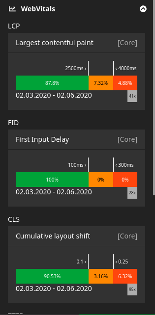

# Web Vitals for Neos

Web Vitals are core metrics for your website's browser rendering health status:  
https://web.dev/vitals

Google is about to add those WebVitals to their ranking algorithm.  
This plugin adds Real User Monitoring for those metrics to your Neos site 
so you can track and improve it accordingly.
https://webmasters.googleblog.com/2020/05/evaluating-page-experience.html

The plugin is GDPR safe as we do not collect any personal data at all or even send them to some third party.
It is about collecting data about your website, not about your visitors (real user monitoring).  

## What this Neos plugin does
This plugin tracks certain metrics from your website with the JavaScript Beacon API. As soon as a measure is captured, 
it is being tracked - the measure largely depends on the client (tab active etc.).  
The idea is to capture the data and show the data for each single site, document and dimension.  

> :warning: Data may increase to large amounts easily as it is stored in the database to start with.

In the backend you find a tab in the inspector of every page. 
Only non-personal data are stored.



You also have a complete overview in a separate backend module.
This helps you to find overall weaknesses with your website.  

  

After installation let it take some time to capture a set of data.
The analysis is real time, so you can see results as soon as your page has been viewed. 

## Installation

TechDivision.WebVitals is available via packagist. Add `"techdivision/web-vitals" : "~1.0"` to the require section of the composer.json
or run `composer require techdivision/web-vitals`.  

### Configuration
There are some options for configuration and integration available:

#### Disable Tracking
You can disable the tracking - e.g. when you have a multi-site setup and only want to track on certain sites - 
by adding the following lines to the correct Settings.yaml:
```
TechDivision:
  WebVitals:
    enableTracking: false
```

#### Fusion
The package extends the `Neos.Neos:Page` prototype and adds some JavaScript to the very bottom of the page. 
This should be safe and not interfere with the rest of your JavaScript.

### ToDo
The plugin is in a very early stage, but it already can guide you the way to improve your website performance.  
Some areas of improvement for the future:  
* Add translations labels
* Improve data storage, e.g. elastic search backend
* Test with large amounts of data
* Add user agent tracking for better comparison between 
* Add requests to a queue for asynchronous tracking
* Select start- and end date in backend module (and in inspector?)

### Contribution
We will be happy to receive pull requests - dont hesitate!